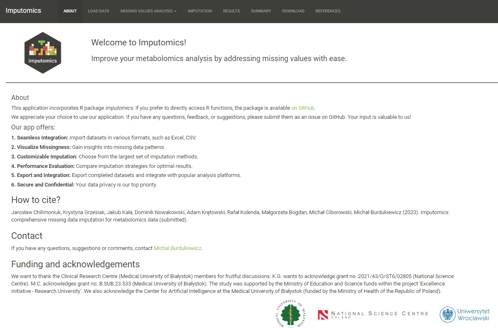

```{r, include = FALSE}
knitr::opts_chunk$set(
  collapse = TRUE,
  comment = "#>"
)
```

```{r setup, message=FALSE, echo=FALSE}
library(imputomics)
```


## Getting Started with the Shiny app

Install the **imputomics** and load it into your R environment:

```{r, eval=FALSE}
devtools::install_github("BioGenies/imputomics")
library(imputomics)
```

If everything went fine you can run the app with:

```{r, eval = FALSE}
imputomics_gui()
```



## Load your data

In the **Load data** tab you can upload your dataset. 
You need to choose how missing values are marked in your file. It can be either **NA**, **0**, **1**.
You can preview uploaded data in the **Entire dataset** tab.


**imputomics** app automatically detects columns with values and groups. You can see them in the **Manage variables** tab. Here you can also manually set which columns are numeric or categorical. The categorical will be ignored during imputation.


In the **Imputation dataset** you can see which columns will be imputed.


## Missing values analysis

In the **Data management** tab you can set the maximum amount of missing values in each variable and remove them. The default value is 20\% of missing values.
Moreover, you can set groups by the grouping variable set automatically or manually in the previous step. However groups shouldn't have more than 4 variables. Now you will remove only those variables, that exceed the set threshold. 
On the Venn diagram you can see how many variables exceed set threshold in each group and how many are of the are in both groups.
Click remove to remove variables. You can also restore data by clicking undo.


In the **Visualization** you can draw a bar plot with the percentages of missing values in each variable that exceed set threshold. 


On the heatmap you can preview in which samples missing values have appeared. 


You can download both plots clicking in a button in top right corner.

## Imputation

Here you can choose which MVIA you want to use. To simplify the process we have added sliders to select top 10 fastest methods, top 10 most accurate methods, and the top 5 most accurate methods for given missing value type. 
Remember to analyse your data and pick methods that are most suited to the structure of your data. As searching for methods that fit a predefined hypothesis will lead to the issue of multiple comparisons and significant overfitting. Consider nuances such as distribution, scale, missing value patterns, and relationships for a more accurate and reliable outcome, adhering to best practices in data analysis.

Clicking the **Impute** button will start the imputation process. On the bottom is progress bar.


## Results

Here you can check the results of imputation and which methods failed to impute.


## Summary

Here you can observe the distribution of your data and the distribution of imputed missing values depending on used method. You can download plot clicking in a button in top right corner


## Download

You can download your data imputed by selected methods. Each MVIA will be in separate spreadsheet.


